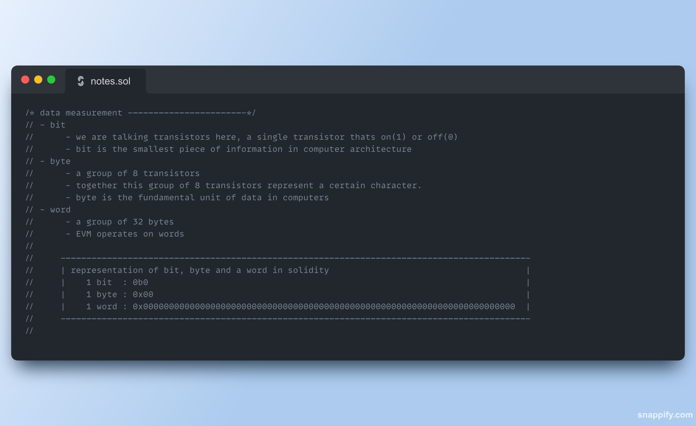
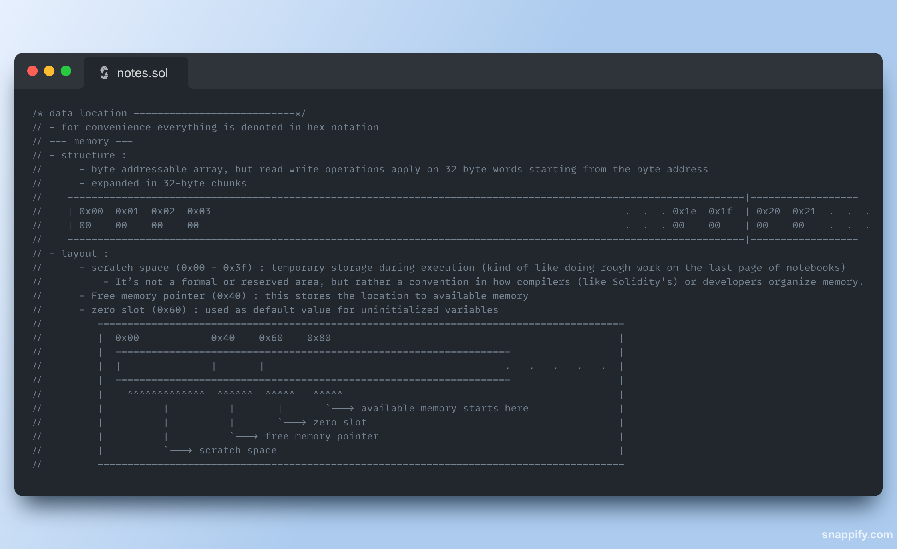

# Essential-EVM-Assembly (2/5)

[](https://soliditylang.org)
[](https://www.gnu.org/licenses/gpl-3.0.html)


EVM Assembly is layered with conceptual nuances. This resource aims to simplify foundational concepts for understanding EVM assembly. Topics are introduced from basics like bits bytes and gradually moving towards the complex topics like endianness, slot alignment and memory layouts. Notes are presented in a clear conscise manner with supporting diagrams for crucial concepts. Use this resource as a short notes refresher while you are on your journey to master the EVM.





## Contents
- data measurement 
- data interpretation
- data systems
- datatypes
- literals
- endian orders
- data alignment
- data location
- data addresses
- gas notes
- opcodes
- inline assembly(yul)
- further additions
  - pragmatic applications of inline assembly
  - gas optimization from first principles
  - footguns in assembly


## Getting Started
### foundry
```bash
git clone https://github.com/AtharvSan/Essential-EVM-Assembly.git
cd Essential-EVM-Assembly
forge install
forge compile
```
### remix 
just copy the code from src/EssentialAssembly.sol into remixIDE and you can start playing around.

## Roadmap
Part 2 of a 5 part series on essentials for solidity devs
- Essential-Solidity
- Essential-EVM-Assembly
- Essential-Solidity-Cryptography
- Essential-Solidity-Design-Patterns
- Essential-Solidity-Security

## License
This project is licensed under the GNU General Public License v3.0 (GPL)

---

**Found this useful?** consider dropping a [star ⭐](https://github.com/AtharvSan/Essential-EVM-Assembly) , your support will motivate me to do more such works.

[](https://twitter.com/AtharvSan)
[](https://github.com/AtharvSan)